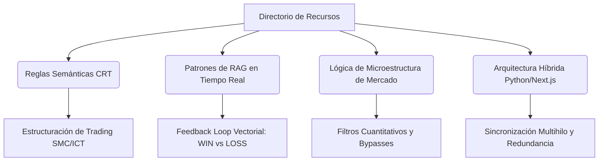

# 📊 Análisis Técnico y Funcional Completo: Dashboard de Trading Híbrido RAG

> **Fecha de Actualización:** 30 de Mayo de 2026  
> **Alcance:** Arquitectura, frameworks, detalle granular de funcionalidad, transferencia de conocimiento de IA e ideas de proyectos a partir del directorio `tradingview-gratis-master`.

---

## 📁 Índice de Archivos del Directorio (Con Enlaces Activos)

A continuación se detalla la estructura del directorio. Puede hacer clic en cualquiera de los archivos para acceder a ellos directamente:

```
tradingview-gratis-master/
├── 🐍 Backend & Inteligencia:
│   ├── [mt5_bridge.py](file:///C:/Proyectos/tradingview-gratis-master/mt5_bridge.py)                # Motor de ejecución Python e integraciones COM
│   ├── [context_engine.py](file:///C:/Proyectos/tradingview-gratis-master/context_engine.py)            # Motor de inteligencia vectorial (ChromaDB + NLP)
│   ├── [config_crt.json](file:///C:/Proyectos/tradingview-gratis-master/config_crt.json)              # Parámetros cuantitativos de trading (Capa 1)
│   └── [crt_rules_curated.md](file:///C:/Proyectos/tradingview-gratis-master/crt_rules_curated.md)         # Base de conocimiento CRT en lenguaje natural
│
├── ⚛️ Frontend (Next.js & React):
│   ├── [package.json](file:///C:/Proyectos/tradingview-gratis-master/package.json)                 # Dependencias del frontend
│   └── src/
│       ├── app/
│       │   ├── [page.tsx](file:///C:/Proyectos/tradingview-gratis-master/src/app/page.tsx)             # Página principal del dashboard de trading
│       │   ├── [layout.tsx](file:///C:/Proyectos/tradingview-gratis-master/src/app/layout.tsx)           # Layout de la app con providers y fuentes
│       │   └── [globals.css](file:///C:/Proyectos/tradingview-gratis-master/src/app/globals.css)          # Estilos globales y tokens CSS Tailwind 4
│       │
│       ├── components/
│       │   ├── chart/
│       │   │   ├── [PriceChart.tsx](file:///C:/Proyectos/tradingview-gratis-master/src/components/chart/PriceChart.tsx)   # Gráfico interactivo (Lightweight Charts)
│       │   │   ├── [SymbolSelector.tsx](file:///C:/Proyectos/tradingview-gratis-master/src/components/chart/SymbolSelector.tsx) # Selector de par de divisas
│       │   │   ├── [TimeframeSelector.tsx](file:///C:/Proyectos/tradingview-gratis-master/src/components/chart/TimeframeSelector.tsx) # Selector de temporalidad
│       │   │   ├── [IndicatorMenu.tsx](file:///C:/Proyectos/tradingview-gratis-master/src/components/chart/IndicatorMenu.tsx) # Menú selector de indicadores
│       │   │   └── [MeasureOverlay.tsx](file:///C:/Proyectos/tradingview-gratis-master/src/components/chart/MeasureOverlay.tsx) # Overlay de medición precio/tiempo
│       │   │
│       │   ├── dashboard/
│       │   │   ├── [AccountStats.tsx](file:///C:/Proyectos/tradingview-gratis-master/src/components/dashboard/AccountStats.tsx) # Métricas de la cuenta de trading
│       │   │   ├── [HistoryPanel.tsx](file:///C:/Proyectos/tradingview-gratis-master/src/components/dashboard/HistoryPanel.tsx) # Historial de operaciones vectoriales
│       │   │   └── [PositionsTable.tsx](file:///C:/Proyectos/tradingview-gratis-master/src/components/dashboard/PositionsTable.tsx) # Gestión de posiciones activas
│       │   │
│       │   └── layout/
│       │       ├── [LeftSidebar.tsx](file:///C:/Proyectos/tradingview-gratis-master/src/components/layout/LeftSidebar.tsx)    # Configuración avanzada del bot (33KB)
│       │       └── [RightSidebar.tsx](file:///C:/Proyectos/tradingview-gratis-master/src/components/layout/RightSidebar.tsx)   # Panel de órdenes manuales y bots
│       │
│       └── lib/
│           ├── data/
│           │   └── [mock-feed.ts](file:///C:/Proyectos/tradingview-gratis-master/src/lib/data/mock-feed.ts)     # Feed de datos asíncronos y puente WS
│           ├── store/
│           │   ├── [trading-store.ts](file:///C:/Proyectos/tradingview-gratis-master/src/lib/store/trading-store.ts) # Estado global de la cuenta y bot
│           │   └── [chart-store.ts](file:///C:/Proyectos/tradingview-gratis-master/src/lib/store/chart-store.ts)   # Estado del gráfico e indicadores
│           ├── indicators/
│           │   └── [index.ts](file:///C:/Proyectos/tradingview-gratis-master/src/lib/indicators/index.ts)         # Algoritmos de cálculo matemático técnico
│           ├── strategies/
│           │   └── [runner.ts](file:///C:/Proyectos/tradingview-gratis-master/src/lib/strategies/runner.ts)         # Strategy Runner (EMA Cross 9/21)
│           ├── trading/
│           │   └── [risk-guard.ts](file:///C:/Proyectos/tradingview-gratis-master/src/lib/trading/risk-guard.ts)     # Risk Guard (Frenos de emergencia)
│           │
│           ├── binance/                                 # Integraciones Binance (Sin uso activo)
│           │   ├── [rest.ts](file:///C:/Proyectos/tradingview-gratis-master/src/lib/binance/rest.ts)           # Cliente REST API
│           │   └── [ws.ts](file:///C:/Proyectos/tradingview-gratis-master/src/lib/binance/ws.ts)             # Cliente WebSocket multiplexado
│           │
│           └── ctrader/                                 # Integraciones cTrader (Sin uso activo)
│               ├── [client.ts](file:///C:/Proyectos/tradingview-gratis-master/src/lib/ctrader/client.ts)         # Cliente de red TCP Protobuf
│               └── proto/                               # Esquemas y compilados Protobuf
```

---

## 🔧 1. Análisis Técnico y Usabilidades por Archivo

A continuación se detalla para cada archivo clave: el tipo de código, las herramientas/frameworks implicados, un desglose funcional detallado y su matriz de usabilidad.

### 🐍 BACKEND & MOTOR DE INTELIGENCIA (Python)

#### 1. [mt5_bridge.py](file:///C:/Proyectos/tradingview-gratis-master/mt5_bridge.py)
* **Tipo de Código:** Python asíncrono (`asyncio`), procesamiento multiproceso/concurrente (`threading`), integraciones API nativas de Windows (COM) y serialización estructurada de datos (JSON).
* **Herramientas & Frameworks:** `MetaTrader5` (API oficial de Windows para interactuar con terminales MT5 de escritorio), `websockets` (servidor de red de baja latencia), `chromadb` y `sentence_transformers` (opcionales para validar en base vectorial).
* **Detalle de Funcionalidad:**
  * **Motor de Comunicaciones (WebSocket Server):** Inicia un servidor en `ws://127.0.0.1:8000` que gestiona de manera asíncrona múltiples conexiones entrantes del frontend. Envía periódicamente ticks, métricas de cuenta e historial.
  * **Bucle de Conexión MT5:** Inicializa de manera persistente la conexión con la terminal local MetaTrader 5, resolviendo nombres de símbolos (como añadir sufijos del bróker `.ecn` o `.pro` de forma dinámica).
  * **Bypass Dinámico y Filtros:** Permite que el frontend active o desactive en tiempo real reglas individuales de validación (por ejemplo, omitir filtros de ATR o deshabilitar el guard de spread).
  * **Risk Guard Centralizado:** Evalúa en cada tick las pérdidas acumuladas en el día. Si el drawdown alcanza el límite diario (por defecto 4.5%) o total (8%), ejecuta un cierre forzado de todas las posiciones (cierre de pánico) y bloquea la entrada de nuevas órdenes.
  * **Pipeline de Ejecución en 3 Capas:**
    1. *Capa 1 (Determinista):* Comprueba límites numéricos estrictos (spread actual < 20% del ATR, volumen del cuerpo de vela ≥ 10% del ATR, operar solo dentro de Killzones horarias configuradas).
    2. *Capa 2 (Estructural/Contextual):* Evalúa condiciones de barrido de liquidez (sweeps de mechas) en temporalidades bajas (LTF) tras tocar niveles clave en temporalidades altas (HTF).
    3. *Capa 3 (Exclusión Semántica):* Solicita validación al `context_engine` usando embeddings vectoriales para determinar si el contexto actual se asemeja a trades perdedores históricos o reglas de exclusión.
  * **Ejecutor de Órdenes:** Traduce las peticiones JSON del frontend a estructuras `mt5.OrderSend` (compras, ventas, modificaciones de SL/TP, cierres parciales/totales) y procesa los retornos del servidor del bróker.

##### Tabla de Usabilidad:
| Módulo / Proceso | Entrada | Salida | Latencia Estimada |
|---|---|---|---|
| **Tick Broadcaster** | Evento tick de MT5 | Stream JSON en WS | ~10-15 ms |
| **Escáner Autónomo** | Series temporales (M1/M5) | Órdenes de mercado | ~50 ms |
| **Risk Guard (Drawdown)** | Datos de cuenta MT5 | Cierre masivo de posiciones | < 10 ms |

---

#### 2. [context_engine.py](file:///C:/Proyectos/tradingview-gratis-master/context_engine.py)
* **Tipo de Código:** Python orientado a objetos, procesamiento de lenguaje natural (NLP), codificación de texto en vectores matemáticos (embeddings) e indexación en base de datos documental.
* **Herramientas & Frameworks:** `chromadb` (Base de datos vectorial ligera embebida), `sentence_transformers` (utiliza el modelo pre-entrenado local `all-MiniLM-L6-v2` para procesar oraciones de texto a vectores de 384 dimensiones).
* **Detalle de Funcionalidad:**
  * **Inicializador de Base de Datos:** Al arrancar, analiza el archivo markdown `crt_rules_curated.md`. Divide el documento mediante expresiones regulares usando encabezados (`##` y `###`), eliminando caracteres especiales. Genera representaciones vectoriales para cada bloque de reglas y las inserta en la colección `crt_rules` de ChromaDB.
  * **Evaluador de Similitud Semántica (RAG):** Recibe descripciones contextuales en lenguaje natural generadas por el puente de trading (ej: `"EURUSD sweep at high during London Open, high spread"`). Realiza una búsqueda de vecinos más cercanos utilizando la distancia de coseno contra las reglas de exclusión de la Capa 3. Si la distancia vectorial es inferior a un umbral configurado (ej. 0.35), emite una señal de bloqueo para denegar la operación.
  * **Feedback Loop de Aprendizaje:** Expone métodos para registrar operaciones finalizadas. Cuando un trade se cierra, se codifica su contexto operativo junto con su resultado final (ganancia/pérdida). Las operaciones ganadoras se asocian a patrones recomendados (Capa 2) y las perdedoras a patrones de bloqueo (Capa 3), automatizando la optimización del criterio del bot.

##### Tabla de Usabilidad:
| Método Principal | Propósito | Dependencia | Entrada de Datos |
|---|---|---|---|
| `initialize_db()` | Indexar reglas de trading | `crt_rules_curated.md` | Texto plano Markdown |
| `validate_context()` | Evaluar viabilidad de trade | ChromaDB Query | Texto descriptivo del mercado |
| `record_trade()` | Almacenar experiencia | ChromaDB Insert | Dict con métricas del trade |

---

#### 3. [config_crt.json](file:///C:/Proyectos/tradingview-gratis-master/config_crt.json)
* **Tipo de Código:** JSON (Configuración declarativa estructurada).
* **Detalle de Funcionalidad:**
  * Almacena de forma centralizada todas las constantes físicas del trading de precisión.
  * **Configuración Horaria:** Huso de referencia (`Atlantic/Canary`), horas de anclaje (HTF de H4 a las 06:00, 10:00, 14:00) y rangos horarios exactos para las Killzones (London Open, NY Open, NY PM, Magic Hour y el ciclo Nine AM).
  * **Reglas Físicas de Mercado:** Umbrales de dimensión mínima para Forex (0.08% de movimiento respecto al ATR) y para Índices (20 puntos), límites máximos de spread y umbrales de drawdown financiero (4.5% diario, 8.0% total).

---

#### 4. [crt_rules_curated.md](file:///C:/Proyectos/tradingview-gratis-master/crt_rules_curated.md)
* **Tipo de Código:** Markdown estructurado.
* **Detalle de Funcionalidad:**
  * Base de conocimiento escrita en lenguaje natural que detalla la metodología CRT (Confluence, Risk & Time).
  * Se divide en **Capa 1 (Reglas Duras)**, **Capa 2 (Reglas Contextuales de Entrada)** y **Capa 3 (Reglas de Exclusión)**. Sirve como origen de datos principal para que el `context_engine` entrene semánticamente la base de datos ChromaDB.

---

### ⚛️ FRONTEND & COMPONENTES REACT (Next.js / TypeScript)

#### 5. [src/lib/data/mock-feed.ts](file:///C:/Proyectos/tradingview-gratis-master/src/lib/data/mock-feed.ts)
* **Tipo de Código:** TypeScript asíncrono, programación reactiva basada en eventos del navegador y enrutamiento dinámico de datos.
* **Herramientas & Frameworks:** API nativa `WebSocket` del navegador, Zustand Stores para inyección directa de estado.
* **Detalle de Funcionalidad:**
  * **Canalizador WebSocket (MT5 Link):** Abre la conexión de red con `ws://127.0.0.1:8000`. Implementa políticas automáticas de reconexión y monitoriza el estado de la comunicación (ping/pong).
  * **Generador de Simulación (Mock Fallback):** Si el servidor Python no está disponible, el archivo cambia a modo simulación. Utiliza algoritmos de generación de precios basados en caminos aleatorios con tendencias configurables (bullish/bearish) para alimentar el gráfico y las estadísticas.
  * **Router y Despachador de Ticks:** Recibe los ticks reales de MT5, calcula los precios de apertura, máximo, mínimo y cierre (OHLC) del timeframe activo, y actualiza de manera progresiva el gráfico visual.
  * **Traductor de Órdenes:** Recibe las intenciones de operación desde el frontend y las envía en formato JSON al socket de Python.

---

#### 6. [src/lib/store/trading-store.ts](file:///C:/Proyectos/tradingview-gratis-master/src/lib/store/trading-store.ts)
* **Tipo de Código:** TypeScript reactivo.
* **Herramientas & Frameworks:** `Zustand` como gestor de estado global y `Zustand Persist Middleware` para persistencia en almacenamiento local (`localStorage`).
* **Detalle de Funcionalidad:**
  * Mantiene y actualiza el estado de la cuenta conectada, incluyendo saldos en vivo (balance, equidad, margen libre, ganancias flotantes).
  * Almacena y sincroniza la lista de posiciones de mercado abiertas y el historial de operaciones vectoriales recuperado de ChromaDB.
  * Gestiona los 30+ parámetros dinámicos de configuración del robot que el usuario ajusta desde la interfaz visual (lotes por operación, killzones activas, estrategias y bypasses de validación).

---

#### 7. [src/components/chart/PriceChart.tsx](file:///C:/Proyectos/tradingview-gratis-master/src/components/chart/PriceChart.tsx)
* **Tipo de Código:** TSX (Componente funcional de React), renderizado y manipulación del DOM gráfico, suscripción a eventos táctiles y de mouse.
* **Herramientas & Frameworks:** `React 19`, `Lightweight Charts 5.2` (desarrollado por TradingView para alto rendimiento de renderizado en Canvas 2D), `TailwindCSS 4` para la estilización premium.
* **Detalle de Funcionalidad:**
  * Renderiza el lienzo gráfico de precios en tiempo real. Configura de forma dinámica las series de velas (CandlestickSeries) y de volumen.
  * Dibuja y actualiza las series de indicadores técnicos seleccionados por el usuario (líneas de EMA, oscilador RSI inferior y panel de MACD).
  * **Superposición de Posiciones en Vivo:** Lee del `trading-store` las posiciones abiertas y dibuja de forma interactiva líneas de precio horizontales que muestran el precio de entrada, Stop Loss y Take Profit de cada posición.
  * Integra herramientas de dibujo dinámicas (herramienta de medición de pips/tiempo y cursor en cruz).

---

#### 8. [src/lib/strategies/runner.ts](file:///C:/Proyectos/tradingview-gratis-master/src/lib/strategies/runner.ts)
* **Tipo de Código:** TypeScript (Algorítmico y condicional).
* **Herramientas & Frameworks:** Zustand Stores, helpers matemáticos locales.
* **Detalle de Funcionalidad:**
  * Ejecuta la lógica del Strategy Runner en el frontend (actualmente configurada con la estrategia **EMA Cross 9/21**).
  * Recibe cada nueva vela completada, calcula los valores de EMA 9 y EMA 21, y evalúa cruces:
    * **Señal de Compra (Buy):** EMA 9 cruza hacia arriba a la EMA 21.
    * **Señal de Venta (Sell):** EMA 9 cruza hacia abajo a la EMA 21.
  * Antes de emitir una orden, consulta al `risk-guard.ts` local para verificar que los límites financieros no estén vulnerados. Si todo es correcto, realiza una petición POST al endpoint de órdenes.

---

#### 9. [src/lib/indicators/index.ts](file:///C:/Proyectos/tradingview-gratis-master/src/lib/indicators/index.ts)
* **Tipo de Código:** TypeScript (Matemático / Funciones puras).
* **Detalle de Funcionalidad:**
  * Contiene los algoritmos para calcular los indicadores técnicos primarios del gráfico en el cliente:
    * **SMA (Simple Moving Average):** Promedio aritmético básico sobre un periodo móvil.
    * **EMA (Exponential Moving Average):** Aplica un factor de suavizado exponencial con un seed calculado mediante SMA inicial.
    * **RSI (Relative Strength Index):** Calcula la relación entre ganancias y pérdidas promedio utilizando el suavizado de Wilder sobre una ventana temporal (por defecto 14 periodos).
    * **MACD (Moving Average Convergence Divergence):** Calcula la diferencia entre una EMA rápida (12) y una EMA lenta (26), generando además la línea de señal (EMA 9 de la diferencia) y el histograma visual.

---

### 🌐 INTEGRACIONES AUXILIARES (Binance y cTrader)

#### 10. [src/lib/binance/rest.ts](file:///C:/Proyectos/tradingview-gratis-master/src/lib/binance/rest.ts) & [ws.ts](file:///C:/Proyectos/tradingview-gratis-master/src/lib/binance/ws.ts)
* **Tipo de Código:** TypeScript asíncrono para consumo de APIs financieras externas de alta velocidad.
* **Herramientas & Frameworks:** API REST pública de Binance y protocolo WebSocket multiplexado.
* **Detalle de Funcionalidad:**
  * **rest.ts:** Proporciona funciones para consultar klines históricos, tickers de 24 horas y reglas de símbolos de intercambio (Exchange Info) directamente desde los servidores de Binance.
  * **ws.ts:** Implementa un cliente de WebSocket multiplexado capaz de suscribirse a flujos combinados de ticks y velas de múltiples activos criptográficos en un solo canal TCP. Cuenta con auto-reconexión y reconexión exponencial.

---

#### 11. [src/lib/ctrader/client.ts](file:///C:/Proyectos/tradingview-gratis-master/src/lib/ctrader/client.ts)
* **Tipo de Código:** TypeScript de bajo nivel orientado a la comunicación por socket binario TCP estructurada.
* **Herramientas & Frameworks:** `protobufjs` para serializar y deserializar los esquemas binarios oficiales de cTrader Open API v2.
* **Detalle de Funcionalidad:**
  * Diseñado para conectarse directamente a la pasarela de red de cTrader.
  * Maneja el empaquetado y desempaquetado de payloads binarios utilizando búferes de protocolo (Protobuf) para enviar solicitudes de autenticación de aplicaciones y cuentas, suscribirse a canales de mercado en tiempo real y enviar comandos de órdenes directas.

---

## 🧠 2. Qué podría aprender una Herramienta de IA utilizando estos Recursos

La arquitectura del proyecto ofrece un entorno de aprendizaje valioso para un sistema de inteligencia artificial. A continuación se detallan las áreas de conocimiento que una IA puede absorber del directorio:



### A. Estructuración y Modelado de Reglas de Trading (SMC/CRT)
* **Lo que aprende la IA:** Cómo transformar una metodología de trading discrecional compleja (como el análisis institucional *Smart Money Concepts*) en un árbol de decisión estructurado en tres niveles.
* **Aplicación práctica:** La IA puede estudiar cómo el archivo `crt_rules_curated.md` y `config_crt.json` modelan reglas abstractas (ej. *"barrido de liquidez"* o *"manipulación del ciclo Nine AM"*) mediante límites numéricos rigurosos y relaciones semánticas. Aprende a redactar reglas de trading de modo que sean parseables y evaluables por un LLM o base vectorial.

### B. Patrones de Diseño RAG (Retrieval-Augmented Generation) para Operaciones Críticas
* **Lo que aprende la IA:** Cómo implementar un sistema de validación semántica en tiempo real que no dependa de APIs de LLM externas de alta latencia.
* **Aplicación práctica:** Analizando `context_engine.py`, la IA aprende a estructurar un flujo donde:
  1. El estado actual de un sistema en tiempo real se traduce a una cadena descriptiva corta (String Context).
  2. Se realiza una búsqueda por similitud de coseno contra directrices estáticas (Reglas de Capa 3) y experiencias históricas dinámicas.
  3. Se calcula la distancia vectorial para vetar o aprobar una acción de ejecución crítica.

### C. Lógica de Microestructura y Gestión de Riesgo (Risk Guard)
* **Lo que aprende la IA:** Cómo codificar protecciones ante eventos imprevistos del mercado (como spread spikes, noticias de alto impacto o drawdowns consecutivos).
* **Aplicación práctica:** La IA puede analizar las funciones de validación de `mt5_bridge.py` y `risk-guard.ts` para entender la relación entre volatilidad (ATR) y límites operativos (Spread máximo tolerable, wick-to-body ratios). Aprende a diseñar sistemas con "cierre de pánico" a nivel de servidor que invalidan las peticiones del frontend en caso de riesgo financiero.

### D. Coordinación y Redundancia de Flujos de Datos en Tiempo Real
* **Lo que aprende la IA:** Cómo construir una aplicación financiera que sincroniza un backend multihilo en Python con un frontend reactivo en Next.js.
* **Aplicación práctica:** El análisis de `mock-feed.ts` y `mt5_bridge.py` enseña a la IA a gestionar la sincronización de estados reactivos (Zustand) mediante flujos de WebSockets bidireccionales, incluyendo la gestión de pérdidas de conexión y simulaciones dinámicas en caso de caída del servidor primario.

---

## 💡 3. Ideas y Ejemplos de Proyectos Desarrollables

A partir de los módulos del directorio, se proponen los siguientes 5 proyectos de desarrollo avanzado:

### 1️⃣ Agente de Trading Autónomo Asistido por LLM Local (RAG-Trader)
* **Descripción:** Un bot de trading autónomo que complementa el Strategy Runner combinando indicadores técnicos con la evaluación cualitativa de un LLM local (ej. Llama 3 en Ollama) ejecutándose en la misma máquina.
* **Cómo se construye usando la base actual:**
  * Se utiliza el `context_engine.py` para consultar en ChromaDB las experiencias del mercado en situaciones análogas.
  * En lugar de tomar una decisión basada únicamente en un umbral de distancia vectorial, se envía la descripción del mercado y los fragmentos de las experiencias recuperadas (WINs y LOSSes históricos) en un prompt a Ollama.
  * El LLM local responde en <150ms indicando `"EJECUTAR"` o `"BLOQUEAR"`, junto con una justificación en lenguaje natural que se guarda en el historial de la UI.
* **Casos de uso:** Operaciones automatizadas en Forex e Índices con explicaciones contextuales de por qué el bot decidió omitir una señal técnica concreta.

---

### 2️⃣ Simulador y Entrenador de Reglas SMC / CRT para Traders
* **Descripción:** Una aplicación educativa interactiva diseñada para que traders principiantes practiquen la metodología SMC/CRT. Evalúa en tiempo real si sus operaciones simuladas cumplen con las reglas institucionales.
* **Cómo se construye usando la base actual:**
  * Se aprovecha el componente `PriceChart.tsx` y el `mock-feed.ts` para reproducir gráficos de velas históricas en un modo interactivo de simulación (Market Replay).
  * Cuando el usuario pulsa "Comprar" o "Vender" manualmente sobre el gráfico, el sistema recopila los parámetros del mercado (hora local del tick, spread, ATR de las últimas velas, sweeps detectados).
  * El sistema envía los datos al motor de reglas del backend y calcula un **"CRT Compliance Score"** (del 0% al 100%). Si la operación viola una regla crítica (ej. operar fuera de Killzone o con alto spread), muestra una alerta interactiva explicando qué regla se infringió basándose en `crt_rules_curated.md`.
* **Casos de uso:** Plataforma de entrenamiento de academias de trading y preparación para exámenes de cuentas de fondeo.

---

### 3️⃣ Copiador de Operaciones Inteligente y Multibroker (Smart Trade Copier)
* **Descripción:** Un enrutador de órdenes de trading centralizado que permite copiar operaciones ejecutadas en la terminal MT5 del usuario hacia cuentas de cTrader y exchanges de Criptomonedas (Binance) de forma simultánea.
* **Cómo se construye usando la base actual:**
  * Se activan y completan los módulos inactivos del directorio: `src/lib/binance/` y `src/lib/ctrader/`.
  * Se crea un módulo enrutador (`trade-router.ts`) en el frontend que escucha los eventos de órdenes exitosas del `mt5_bridge.py`.
  * Al detectar una orden en MT5, el enrutador calcula los tamaños de posición equivalentes según el saldo de cada plataforma, traduce los tipos de orden al formato respectivo y envía las órdenes simultáneamente usando el cliente Protobuf de cTrader y la API REST/WS de Binance.
* **Casos de uso:** Diversificación de carteras para gestores de cuentas que desean replicar estrategias de Forex en mercados cripto y brokers institucionales ECN.

---

### 4️⃣ Diario de Trading Inteligente con Análisis de Sesgos Emocionales e Informes PDF
* **Descripción:** Un diario de trading automatizado que lee el historial de operaciones de MetaTrader y analiza semánticamente las causas de las pérdidas, identificando patrones de comportamiento repetitivos (sesgos) del trader para generar informes ejecutivos.
* **Cómo se construye usando la base actual:**
  * Se utiliza el backend de `mt5_bridge.py` para consultar el historial de operaciones de la cuenta conectada.
  * Para cada operación cerrada, el sistema extrae las variables del contexto en el que se abrió (hora, volatilidad, noticias económicas del calendario) y las almacena en la colección de ChromaDB de `context_engine.py`.
  * Un script analiza los trades perdedores y busca similitudes semánticas recurrentes (ej: *"operación abierta por FOMO 5 minutos antes de la Killzone"* o *"sobreoperación tras pérdida anterior"*).
  * Genera un informe periódico (con gráficos visuales de rendimiento y resúmenes descriptivos de sesgos detectados) exportable a PDF.
* **Casos de uso:** Herramienta de auditoría para firmas de trading propietario y traders minoristas dedicados a optimizar su psicología operativa.

---

### 5️⃣ Escáner y Dashboard de Divergencias SMT (Smart Money Tool) en Tiempo Real
* **Descripción:** Un escáner multi-símbolo interactivo que analiza correlaciones estrechas entre múltiples pares de divisas correlacionadas (ej. EURUSD vs GBPUSD) y Criptomonedas (ej. BTCUSDT vs ETHUSDT) para detectar y alertar al usuario sobre divergencias de acumulación institucional (divergencia SMT).
* **Cómo se construye usando la base actual:**
  * Se utiliza el WebSocket multiplexado de `src/lib/binance/ws.ts` para obtener ticks en tiempo real de criptomonedas y el `mt5_bridge.py` para Forex.
  * Se implementa un analizador matemático en el backend que monitorea los máximos y mínimos de las velas en temporalidades de M1/M5 para activos correlacionados.
  * **Lógica del detector SMT:** Si EURUSD hace un mínimo más bajo (Lower Low) pero GBPUSD hace un mínimo más alto (Higher Low) en la misma zona de soporte durante una Killzone, el escáner identifica una divergencia SMT.
  * Se genera una alerta sonora y visual en el dashboard del frontend con un indicador en `PriceChart.tsx` y se envía una notificación push a Telegram o Discord a través de webhooks del backend.
* **Casos de uso:** Panel de control de confluencias para traders de alta precisión que buscan confirmaciones de entradas institucionales antes de operar.
